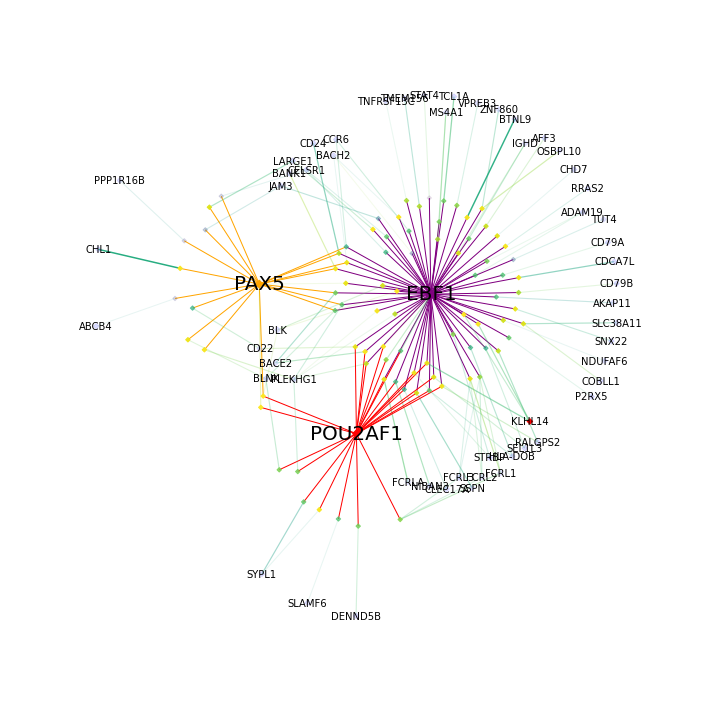
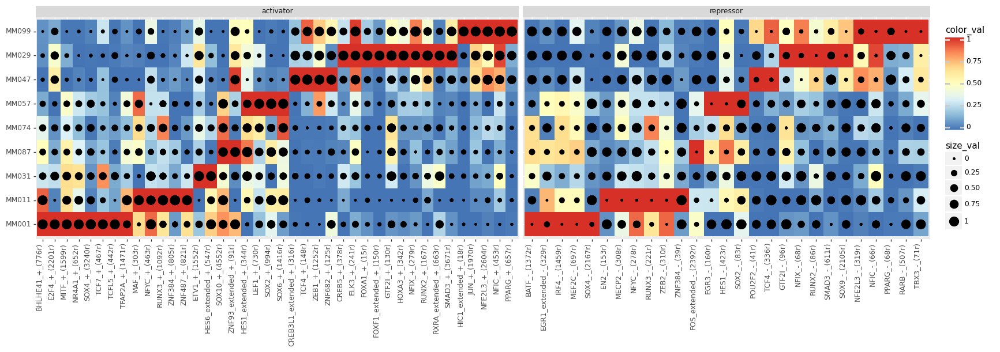
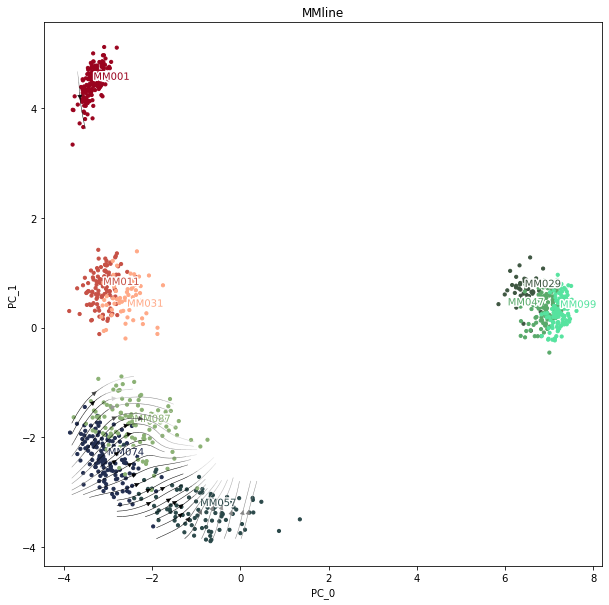
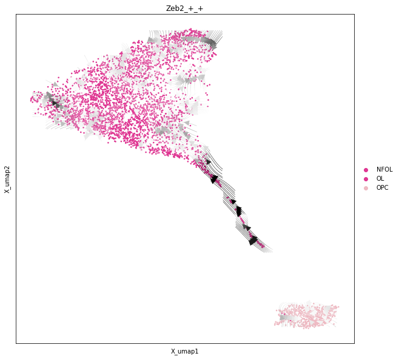

.. _tutorials:

**********
Tutorials
**********

In this section we present several tutorials on using SCENIC+.

Basic SCENIC+ analysis
======================

**From count matrix and fragments file to enhancer driven gene regulatory network (eGRN)**

For getting started with SCENIC+, we recommend this tutorial covering the entire SCENIC+ workflow 
including preprocessing steps. For this tutorial we make use of the 3k PBMCs multiome dataset publicly 
available from 10x Genomics. We'll cover scRNA-seq and scATAC-seq preprocessing, topic modelling, motif enrichment 
analysis, running SCENIC+ and basic downstream analysis.

Get started by clicking :ref:`here <Tutorial: 10x multiome pbmc>` 👈

**Running SCENIC+ step by step**

In the PBMC tutorial (above) we used a wrapper function to run the complete SCENIC+ workflow.
This workflow actually contains many individual steps. If you're curious for these steps
or you want to alter the workflow then this tutorial is for you. 
Here, we will showcase SCENIC+ on multiome data from the human cerebellum. We don't show the
preprocessing steps but we really focus on the individual steps of SCENIC+

Get started by clicking :ref:`here <Tutorial: SCENIC+ step-by-step in the human cerebellum>` 👈

.. image:: images/cerebellum_network.png
    :width: 500

**SCENIC+ analysis on non-multiome data: separate scATAC-seq and scRNA-seq on different cells of the same sample**

It is possible to run the SCENIC+ workflow on samples for which you have separate scATAC-seq and scRNA-seq
on different cells of the same samples. Here, we will generate pseudo-multiome data by sampling cells from
the scRNA-seq and scATAC-seq experiment and combining them into *metacells*. This sampling happens within 
the same celltype. So one prerequisite to be able to run the analysis is a good annotation of the scATAC-seq
data which matches the scRNA-seq annotation, this can be quite challenging. In this example we will analyze 
a mix melanoma cell lines (probably one of the few examples were the annotation is easy).

Get started by clicking :ref:`here <Tutorial: Mix of melanoma cell lines>` 👈

.. toctree::
    :hidden:
    :maxdepth: 3
    
    pbmc_multiome_tutorial.ipynb
    Scenicplus_step_by_step-RTD.ipynb
    mix_melanoma_cell_lines.ipynb

Advanced downstream analysis
============================

**Transcription factor perturbation simulation**

The predicitons of SCENIC+ can be used to simulate the effect of transcription factor perturbations.
We will illustrate this in the melanoma cell line analysis.

Get started by clicking :ref:`here <Tutorial: Perturbation simulation>` 👈

**Unbranched GRN velocity**

The predictions of SCENIC+ can be used to predict in which differentiation "direction" a certain TF will drive a certain cell.
This is term which we call *GRN velocity* (inspired by RNA velocity). These predictions make use between the lag in the sequence of
events between TF expression, region accessibility and target gene expression. In this tutorial this principle is showcased
along an unbranched differentiation trajectory, that of oligodendrocyte differentiation.

Get started by clicking :ref:`here <Tutorial: Unbranched GRN velocity along oligodendrocytes differentiation>` 👈

**Branched GRN velocity**

The predictions of SCENIC+ can be used to predict in which differentiation "direction" a certain TF will drive a certain cell.
This is term which we call *GRN velocity* (inspired by RNA velocity). These predictions make use between the lag in the sequence of
events between TF expression, region accessibility and target gene expression. In this tutorial this principle is showcased
along a branched differentiation trajectory, that of the eye-antennal disk development in fly.

Get started by clicking :ref:`here <Tutorial: Branched differentiation trajectory of fly eye entennal disk>` 👈

.. image:: images/branched_velocity.png
    :width: 500

.. toctree::
    :hidden:
    :maxdepth: 3
    
    Perturbation_simulation.ipynb
    Differentiation_tutorial_unbranched_RTD.ipynb
    Differentiation_tutorial-branched_RTD.ipynb
